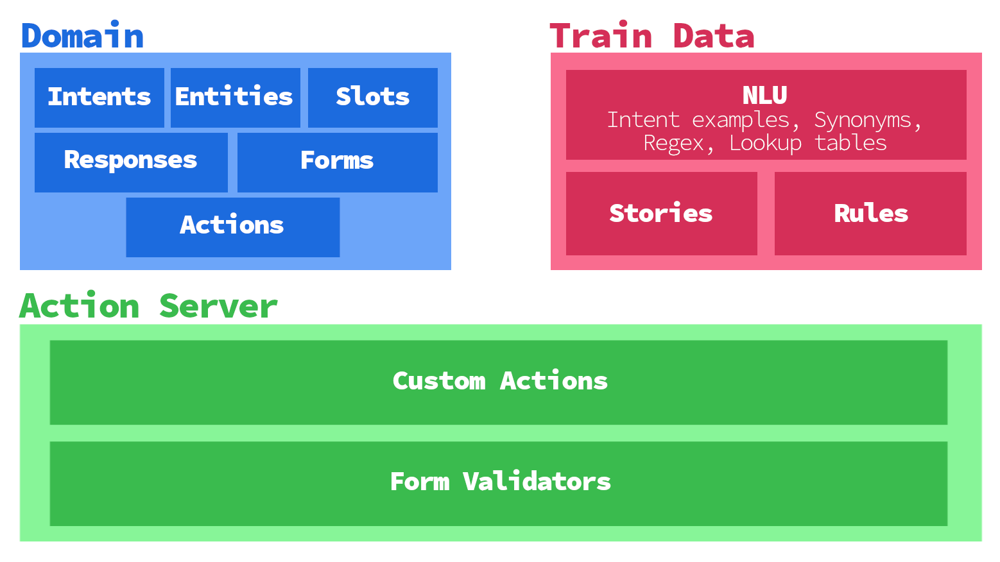

# ElderCare Chatbot
**(Data Science 4th examination project.)**

This project presents a Rasa implementation of a chatbot designed to help the elderly. This serves as a continuation of the work presented in the [2024-edition of the UnivPM's Hack-AI-thon](https://events.dii.univpm.it/Hack-AI-thon/), winner of the *Validity of the technical solutions adopted* Slope Award.

## 📖 Table of Contents
* [🔥 Rasa Open Source](#1)
* [⚙️ How to run the chatbot](#2)

<a id="1"></a>
## 🔥 Rasa Open Source

### What's the deal with this project?
Personally, I found the development learning curve with Rasa to be quite steep.The online documentation is very rich in examples and should be read thoroughly before diving into the code. I tried to do that, at least until time ran out.

That being said, **this is not to be seen as a finished project**, but rather as a starting point for getting acquainted with Rasa. Basic and predictable interactions with the bot will get the job done, although slight changes in what the bot expects from the user can lead to unexpected bot choices. This is most probably due to the lack of enough training data.

>[!TIP]
> I loved the interactive mode (`rasa interactive --domain domains/`). As the documentation suggests, I used it to generate training data instead of manually filling in the stories.

### The architecture of Rasa
Developing with the Rasa framework largely means filling `.yml` files, although some Python code may still be required to implement custom actions. This gives Rasa great flexibility over other web-based chatbot solutions.

<!-- 2 server, files split -->
<p align="center">
    </img>
</p>

#### Splitting the yaml files
When the bot logic stars growing a bit, the `.yml` file, such as `domain.yml`, `data/nlu.yml`, `data/stories.yml` and `data/rules.yml`, esily become quite messy. If the developer is not familiar with the folding mechanism of their IDE, then navigating between the parts of these files will be a feat.

What I did here was split the files on a concern basis.
- The `domain.yml` has been split in `actions.yml`, `entities.yml`, `forms.yml`, `intents.yml`, `responses.yml` and `slots.yml`. This however, require specifying Tasa where to look for those files, appending `--domain domains/` to each command.
- The `nlu.yml`, `stories.yml` and `rules.yml` have been split into multiple files in dedicated folders. Rasa automatically pick them up.

### The NLU pipeline
Rasa's architecture is in line with the CBDP philosophy. In [`config.yml`](config.yml) you can define your own NLU pipeline, where each component is completely interchangeable with any other, and multiple components can be stacked together. I have mostly stuck to the standard pipeline of Rasa.

Roughly, the pipeline can be divided into:
1. *Feature extraction* - The user's input is encoded into a vector of features. By default this is done by two `CountVectorsFeaturize` components, one for word level and the other for **character level to account for typos**. 
    >[!NOTE]
    > `CountVectorsFeaturize`  is essentially a *Bag of Words* encoder. A more powerful approach is the use of a *BERT* transofrmer to embed the sentences in a dense space.

2. *Intent classification* - The default classifier is the `DIETClassifier`. It is a Feed Forward neural network that takes the embedded features and produces a confidence distribution over all the defined intents.
    >[!NOTE]
    > `LogisticRegressionClassifier` is a lighter alternative, i.e. shorter training and model loading time, to the `DIETClassifier`. Moreover, the entity extraction task can be delegated to the `CRFEntityExtractor` component, which has proven to work very well in *NER*.

3. *Entity post-processing* - I found the Facebook's [DucklingEntityExtractor](https://github.com/facebook/duckling) to perform amazingly well at extracting dates and times from user input. I run it as a Docker container with `docker run -p 8000:8000 rasa/duckling`.
   
4. *Fallback recognition* - When the `FallbackClassifier` doesn't find any action having a confidence score greater than the predefined *threshold*, it selects the fallback response, which asks the user to repeat.
5. 

<a id="2"></a>
## ⚙️ How to run the chatbot

1. Train a Rasa model containing the Rasa NLU and Rasa Core models by running:
    ```bash
    rasa train --domain domains/
    ```
    The model will be stored in the `/models` directory as a zipped file.

1. Run an instance of [duckling](https://rasa.com/docs/rasa/nlu/components/#ducklingentityextractor)
   on port 8000 by either running the docker command
    ```bash
    docker run -p 8000:8000 rasa/duckling
    ```
   or [installing duckling](https://github.com/facebook/duckling#requirements) directly on your machine and starting the server.

1. Test the assistant by running:
    ```bash
    rasa run actions
    python load_env.py && rasa run -m models --endpoints endpoints.yml
    ```
    This will load the assistant in your command line for you to chat.

1. *Start the ngrok gateway [Optional]*: in another terminal run
    ```bash
    ngrok http 5005 
    ```
    This will assign you a public ngrok https URL. Put it inside [`credentials.yml`](credentials.yml) in the `webhook_url` field. Then update the Telegram's bot webhook URL running in your terminal
    ```bash
    curl -X POST "https://api.telegram.org/bot<TOKEN>/setWebhook" -d "<YOUR_NGROK_URL>"
    ```
    The `TOKEN` can be read in the `access_token` field in the [`credentials.yml`](credentials.yml) file.

Once the chatbot is ready, you can use it accessing the [@ElderCare_bot](https://web.telegram.org/k/#@ElderCare_bot) bot.
